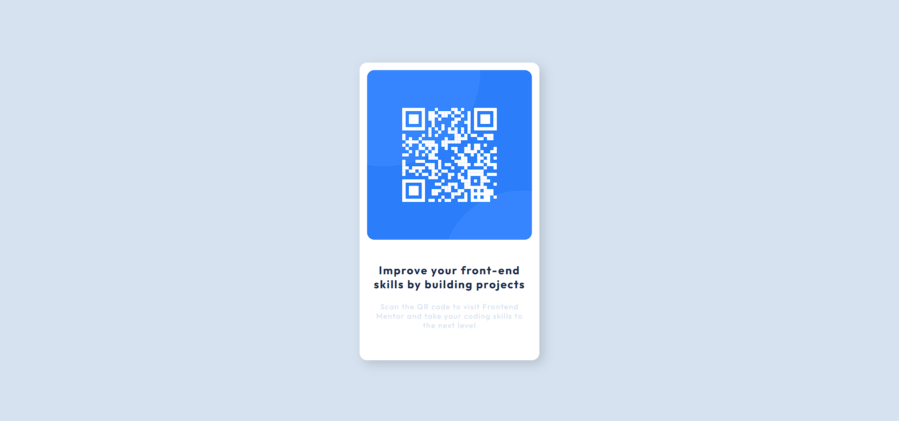

# Frontend Mentor - QR code component solution

This is a solution to the [QR code component challenge on Frontend Mentor](https://www.frontendmentor.io/challenges/qr-code-component-iux_sIO_H).

## Table of contents

- [Frontend Mentor - QR code component solution](#frontend-mentor---qr-code-component-solution)
  - [Table of contents](#table-of-contents)
  - [Overview](#overview)
    - [Screenshot](#screenshot)
    - [Links](#links)
  - [My process](#my-process)
    - [Built with](#built-with)
    - [What I learned](#what-i-learned)
    - [Continued development](#continued-development)
  - [Author](#author)
  - [Acknowledgments](#acknowledgments)

## Overview

### Screenshot

### Links

- Solution URL: [Github Repository](https://github.com/adi-codess/fem_qrcode)
- Live Site URL: [Github Pages](https://adi-codess.github.io/fem_qrcode)

## My process

### Built with

- HTML5
- CSS
- Flexbox

### What I learned

Gained experience in HTML and CSS and also worked on the responsiveness of the website.

### Continued development

- HTML Tags
- CSS Flexbox
- CSS Grids
- Understanding the screen resolutions to improve the responsiveness and user experience of the website.

## Author

<!-- Github -->
- Twitter : [@awvadi](https://www.twitter.com/awvadi)
- Github : [@adi-codess](https://www.github.com/adi-codess)
- Replit : [@adi-codess](https://replit.com/@adi-codess)
- Email : <a href="mailto:adityabagari77@gmail.com">adityabagari77@gmail.com</a>
- Frontend Mentor : [@adi-codess](https://www.frontendmentor.io/profile/adi-codess)

## Acknowledgments

Thanks to the [FrontEnd Mentor](https://www.frontendmentor.io) to challenge me to create this User Interface, for which they also provided me the starter code which helped me to complete the challenge at a much faster rate.